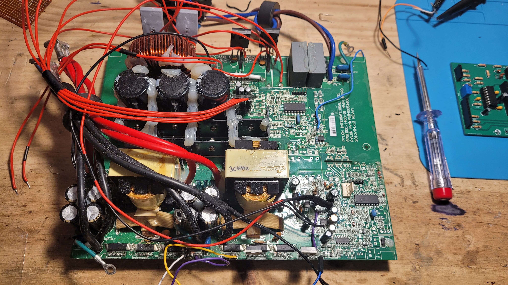
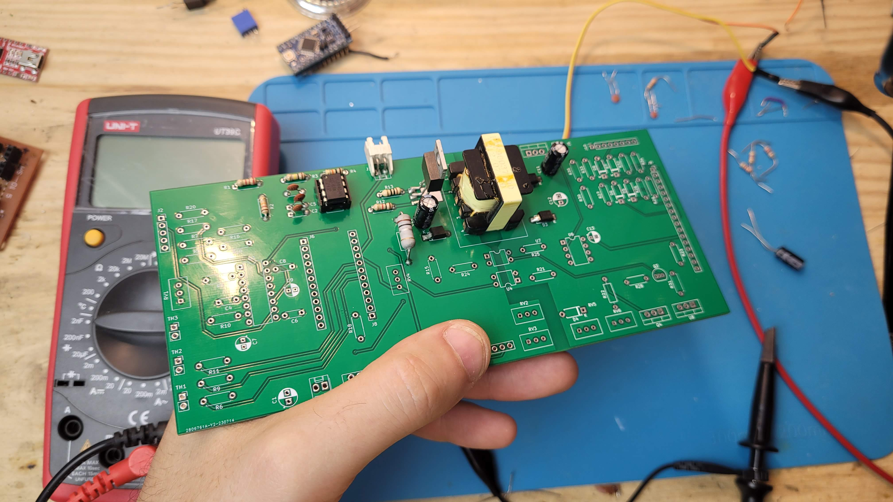

# dyi-inverter
Creación de un inversor partiendo de un Xantrex ProWatt 1400i averiado

Serie de vídeos en youtube:
[youtube](https://www.youtube.com/playlist?list=PLBt3mBwJQwRWf2Qoqq8KDot9ghxqB0hle)

Imágenes:

La idea es remplazar toda la electrónica de control por un circuito nuevo, aprovechando los componentes de potencia existentes en la placa

- arduino: arduino code
- kicad: schemas and gerbers
- pictures: fotografías
- utl: utilidades

